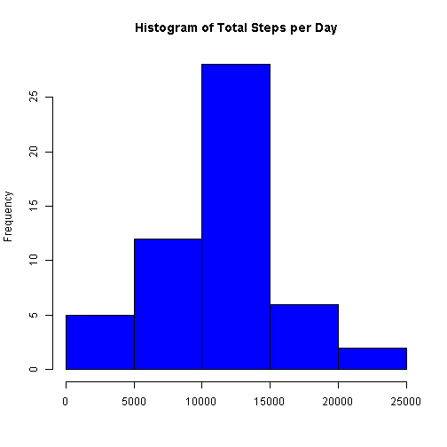
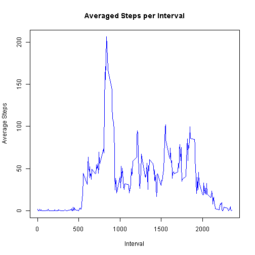
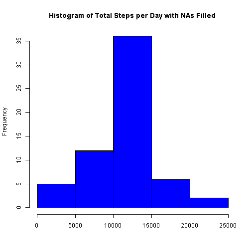
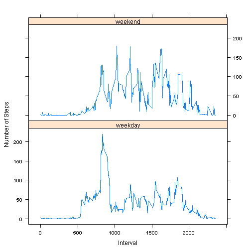

## Loading and preprocessing the data

### 1. Load the data (i.e. read.csv())

```r
if(file.exists('activity.csv')){
    file.remove('activity.csv')
}    
```

```
## [1] TRUE
```

```r
if(!file.exists('activity.zip')){
    stop("input file activity.zip doesn't exist")
}
unzip('activity.zip')
activity_data <- read.csv('activity.csv')
```

### 2. Process/transform the data (if necessary) into a format suitable for your analysis

```r
activity_data$date <- as.Date(activity_data$date)
```


## What is mean total number of steps taken per day?

### 1. Calculate the total number of steps taken per day

```r
library(plyr)
actDataWNAs <- activity_data[!is.na(activity_data$steps),]
stepsxDay <- ddply(actDataWNAs, .(date), function(x) sum(x$steps))
```

### 2. Make a histogram of the total number of steps taken each day

```r
hist(stepsxDay$V1, breaks=5, col="blue", xlab=NULL,
     main="Histogram of Total Steps per Day")
```

 

### 3. Calculate and report the mean and median of the total number of steps taken per day

```r
paste("Total Steps per Day Mean   ==> ", 
      as.character(as.integer(mean(stepsxDay$V1))))
```

```
## [1] "Total Steps per Day Mean   ==>  10766"
```

```r
paste("Total Steps per Day Median ==> ",
      as.character(as.integer(median(stepsxDay$V1))))
```

```
## [1] "Total Steps per Day Median ==>  10765"
```


## What is the average daily activity pattern?

### 1. Make a time series plot of the 5-minute interval (x-axis) and the average number of steps taken, averaged across all days (y-axis)

```r
stepsxIntvl <- ddply(actDataWNAs, .(interval), function(x) mean(x$steps))
plot(stepsxIntvl$interval,stepsxIntvl$V1,type="l",ylab="Average Steps",
     xlab="Interval",col="blue",main="Averaged Steps per Interval")
```

 

### 2.  Which 5-minute interval, on average across all the days in the dataset, contains the maximum number of steps?

```r
paste("Interval with Maximum Steps in Average ==> ",
      stepsxIntvl[stepsxIntvl$V1 == max(stepsxIntvl$V1),1])
```

```
## [1] "Interval with Maximum Steps in Average ==>  835"
```


## Imputing missing values

### 1.  Calculate and report the total number of missing values in the dataset

```r
paste("Total Number of Missing Values ==> ", sum(is.na(activity_data)))
```

```
## [1] "Total Number of Missing Values ==>  2304"
```

### 2.  Devise a strategy for filling in all of the missing values in the dataset
####    ==> The missing values will be filled with the average of the corresponding interval for all days using a function.

### 3.  Create a new dataset that is equal to the original dataset but with the missing data filled in

```r
newActData <- ddply(activity_data, .(date,interval), function(x)
    if(is.na(x$steps)){
        stepsxIntvl[stepsxIntvl$interval == x$interval,2]
    } else {
        x$steps
    }
)
```

### 4.  Make a histogram of the total number of steps taken each day ...and  

```r
stepsxDay2 <- ddply(newActData, .(date), function(x) sum(x$V1))
hist(stepsxDay2$V1, breaks=5, col="blue", xlab=NULL,
     main="Histogram of Total Steps per Day with NAs Filled")
```

 

###     ... and Calculate and report the mean and median total number of steps taken per day. 

```r
paste("Total Steps per Day Mean   ==> ", 
      as.character(as.integer(mean(stepsxDay2$V1))))
```

```
## [1] "Total Steps per Day Mean   ==>  10766"
```

```r
paste("Total Steps per Day Median ==> ",
      as.character(as.integer(median(stepsxDay2$V1))))
```

```
## [1] "Total Steps per Day Median ==>  10766"
```

### ... Do these values differ from the estimates from the first part of the assignment? 
#### ==> They are almost the same. There is only a difference of 1 for the median.

### ... What is the impact of imputing missing data on the estimates of the total daily number of steps?
#### ==> Frequency for the days in the middle increases 


## Are there differences in activity patterns between weekdays and weekends?

### 1.  Create a new factor variable in the dataset with two levels: "weekday" and "weekend" indicating whether a given date is a weekday or weekend day.

```r
newActData$dayType[as.factor(weekdays(newActData$date))
    %in% c("sabado","domingo")] <- "weekend"
newActData$dayType[is.na(newActData$dayType)] <- "weekday"
newActData$dayType <- as.factor(newActData$dayType)
```

### 2.  Make a panel plot containing a time series plot of the 5-minute interval (x-axis) and the average number of steps taken, averaged across all weekday days or weekend days (y-axis)

```r
stepsxIntvl2 <- ddply(newActData, .(interval,dayType), 
    function(x) mean(x$V1))
library(lattice)
xyplot(V1~interval | dayType, data = stepsxIntvl2, type = 'l',
       xlab = 'Interval',  ylab = 'Number of Steps', layout = c(1,2))
```

 

